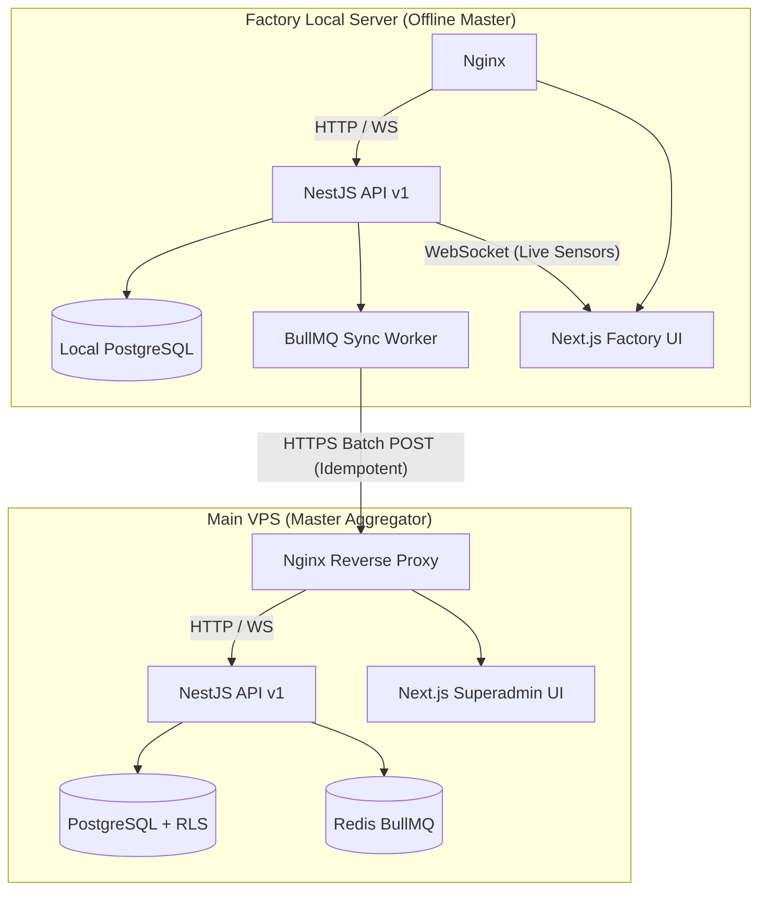

# Final Enterprise SaaS Multi-Factory Architecture Plan (10/10 Edition)

This is the finalized, production-ready blueprint for upgrading the Job Management System (JMS) into a world-class, multi-tenant distributed ERP platform.

## 1. Improved Architecture Changes
We are upgrading from a flat Node.js structure to a **Multi-Tenant Hub-and-Spoke Architecture**:
- **Strict Data Isolation**: Instead of relying on application-level filtering, we enforce **PostgreSQL Row-Level Security (RLS)**. The database physically prevents cross-factory data leakage, even if a query is malformed.
- **Event Mesh**: Introducing Redis Pub/Sub to allow horizontal scaling of the Master VPS API without losing websocket connections or sync queue processing capabilities.

## 2. Updated Database Schema Additions
```prisma
model SyncQueue {
  id             String     @id @default(uuid()) @db.Uuid
  // ... core fields
  entity_version Int        @default(1) // Optimistic locking
  error_message  String?    @db.Text    // Captures exact HTTP/DB error for DLQ
  correlation_id String?    @db.Uuid    // Observability tracing
}

model OperationalEntity { // e.g., JobCard, Machine
  // ... core fields
  factory_id     Int        // Tied to RLS policy
  entity_version Int        @default(1) // MVCC Versioning
  updated_at     DateTime   @updatedAt    // Used with versioning for conflict resolution
}
```

## 3. WebSocket Integration Design
- **Technology**: NestJS `@WebSocketGateway()` powered by `Socket.io`.
- **When to Use**: 
  - **Polling**: STRICTLY used for the background sync_queue to ensure 100% offline reliability and retry mechanisms.
  - **WebSockets**: Used purely for the UI. Emits events like `machine_status_changed` or `sync_lag_alert` directly to the Next.js React frontend for live dashboard updates without refreshing.

## 4. Alerting & Monitoring System Design
- **Integration-Ready Structure**: A modular `NotificationService` in NestJS using the Strategy Pattern. It can route alerts to Email, SMS, or WhatsApp.
- **Automated Alerts**: If a factory's BullMQ `sync_status` remains `FAILED` for > 3 attempts, or if the VPS hasn't received a heartbeat from a factory in 2 hours, it triggers a `FACTORY_OFFLINE` critical alert to the Superadmin dashboard.

## 5. Backup & Recovery Plan
- **VPS Master**: Automated AWS RDS Managed Snapshots daily + Write-Ahead Logging (WAL) via `pgBackRest` for Point-in-Time Recovery (down to the exact minute).
- **Local Factory**: A PM2 cron job runs `pg_dump` daily at 2:00 AM, encrypts it, and uploads it to an S3 bucket configured specifically for that factory.
- **Zero Data Loss Restore**: Superadmins can click "Restore Factory" on the VPS UI. The local server downloads the latest S3 backup, replays its local `sync_queue` against the VPS, and is instantly caught up.

## 6. Performance Optimization Strategy
- **Partitioning**: The global `sync_queue` and `audit_logs` tables on the VPS will be partitioned by `RANGE(created_at)` (monthly) to guarantee index sizes remain in RAM.
- **Batching**: BullMQ workers will pull `100` records at a time and utilize PostgreSQL `INSERT ... ON CONFLICT` for single-roundtrip bulk upserts.
- **Redis Queue**: BullMQ Redis instance tuned with `maxmemory-policy noeviction` so jobs are never dropped during memory spikes.

## 7. Failure Handling Improvements (DLQ & MVCC)
- **MVCC Conflict Resolution**: Local modifications increment `entity_version`. If a delayed sync packet arrives at the VPS with `version = 2`, but the VPS already has `version = 3`, the VPS silently ignores it (Idempotent).
- **Dead Letter Queue (DLQ)**: Corrupted JSON payloads that repeatedly cause `500` errors are caught by the BullMQ worker after 5 exponential backoff retries. They are moved into a permanent `FAILED` state (DLQ) so the rest of the queue continues processing without blocking the factory.

## 8. DevOps Hardening
- **Zero-Downtime Deployments**: Nginx running with `blue/green` upstreams mapping to two PM2 node processes. GitHub Actions updates the idle instance, runs a `/health` check, and flips the Nginx proxy seamlessly.
- **Environment Validation**: NestJS `ConfigModule` with `Joi`. The server will crash on startup rather than run if `.env` variables (like Database connections or API keys) are missing.

## 9. Final System Diagram

