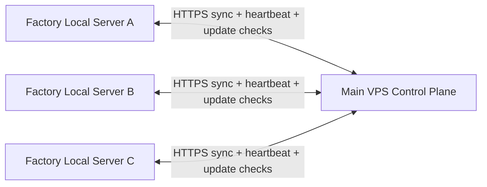

# Local Server Platform Blueprint

This document defines the safe architecture for turning `jms_enterprise` into:

- one main VPS server as the central control plane
- one local server per factory
- bidirectional data sync between VPS and local servers
- automatic module updates from the main VPS to local servers
- superadmin and admin visibility into server status, IP, sync lag, and update state

This blueprint is grounded in the current repository structure:

- `BACKEND/` remains the central API and business backend
- `CLIENT_BRIDGE/` remains the device/scanner bridge
- existing `/api/sync` and `/api/update` surfaces are extended rather than replaced

## 1. Core rule

Do not sync databases by directly copying production PostgreSQL data back and forth between sites.

That approach breaks very quickly because:

- factories can update the same records independently
- partial connectivity causes duplicate or missing writes
- direct DB replication is unsafe across unstable local networks
- module updates and data updates are different problems

The correct design is:

- each site keeps its own operational database
- every write is turned into a tracked sync event
- all sync happens through the VPS hub
- all modules update through a versioned release channel

## 2. Target topology

Every local server talks to the VPS.
Local servers do not sync directly with each other.

This gives:

- one source of global coordination
- cleaner conflict handling
- one place to track node health
- one place to publish module updates

## 3. Runtime components

### Main VPS

The main VPS becomes the control plane and central aggregation point.

It should own:

- factory registry
- local server registry
- sync event ingestion
- sync event fan-out
- release channel for module updates
- health and heartbeat history
- audit log for sync and update actions

### Factory local server

Each factory local server runs its own isolated stack:

- local backend
- local PostgreSQL
- local scanner/device bridge
- local sync agent
- local update agent

The local server must continue to work when internet is down.

That means:

- users at the factory use the local server first
- local writes are accepted immediately
- sync to VPS happens asynchronously with retries

## 4. Roles and permissions

### Superadmin

Superadmin can:

- create a new local server for a factory
- assign a server to a factory
- generate node credentials
- see all local servers and their status
- see current IP, last heartbeat, last push, last pull, sync lag, version, and health
- approve or force module rollout
- pause a node or revoke its credentials
- view sync conflicts and failed jobs

### Factory admin

Factory admin can:

- view their own local server status
- see whether the node is connected
- see local IP and public IP if reported
- see last sync time
- trigger manual sync retry
- view update status for their factory

Factory admin should not manage other factories.

## 5. What must be stored centrally

Add central metadata tables for node management.

Suggested tables:

- `factories`
- `local_servers`
- `local_server_credentials`
- `local_server_heartbeats`
- `sync_nodes`
- `sync_checkpoints`
- `sync_outbox`
- `sync_inbox`
- `sync_conflicts`
- `module_releases`
- `module_release_artifacts`
- `node_update_jobs`
- `node_update_history`

Important fields for `local_servers`:

- `id`
- `factory_id`
- `node_code`
- `node_name`
- `local_ip`
- `public_ip`
- `status`
- `last_heartbeat_at`
- `last_push_at`
- `last_pull_at`
- `current_version`
- `target_version`
- `last_seen_commit`
- `last_error`

## 6. Bidirectional sync design

### Write model

Every business write must do two things in one transaction:

1. update the business table
2. append a sync event into an outbox table

That outbox event should include:

- `event_id`
- `node_id`
- `factory_id`
- `entity_type`
- `entity_id`
- `operation`
- `payload`
- `payload_hash`
- `entity_version`
- `occurred_at`
- `created_by`

### Direction 1: local to VPS

When a user changes data on the local server:

1. local app writes to local DB
2. local app appends an outbox event
3. local sync agent batches unsent events
4. local node sends them to VPS over HTTPS
5. VPS stores them idempotently
6. VPS applies them to central state
7. VPS records checkpoint acknowledgement back to the node

### Direction 2: VPS to local

When central data changes on the VPS:

1. VPS writes business change
2. VPS appends a VPS outbox event
3. each local node asks for events newer than its checkpoint
4. VPS returns only events relevant to that node or factory
5. local node applies them idempotently
6. local node advances its pull checkpoint

### Sync transport

Use pull-based sync initiated by the local node.

Why this is better:

- works behind NAT and normal office routers
- avoids opening inbound LAN ports
- local node can retry safely after network loss
- easier to secure with node-scoped credentials

## 7. Conflict policy

Do not use one global conflict rule for every table.

Use per-entity strategy:

- reference/master data: VPS wins unless explicitly factory-owned
- factory operational data: factory local wins when that factory is the owner
- shared planning data: version-based conflict detection plus manual review queue
- append-only logs: merge without conflict

Every synced entity should have:

- `entity_version`
- `updated_at`
- `updated_by_node`

When conflict happens:

- do not silently overwrite unless rule allows it
- place the event into `sync_conflicts`
- show it to superadmin with resolution tools

## 8. Node registration flow

When superadmin creates a local server:

1. superadmin selects a factory
2. VPS creates a `local_server` record
3. VPS generates a node key or token pair
4. installer package is produced for that node
5. local machine is provisioned with:
   - local backend
   - local database
   - local bridge
   - node credentials
   - configured factory id
6. local node performs first registration handshake
7. VPS stores the node IP and first heartbeat

## 9. Module and code auto-update

Data sync and module update must be separate systems.

### Release process

The VPS should publish versioned releases:

- `release_version`
- `git_sha`
- `docker_image`
- `migration_version`
- `minimum_agent_version`
- `release_notes`

### Local update flow

Each local node runs an updater agent:

1. node checks VPS for latest approved version
2. node compares current version with target version
3. node downloads image or package
4. node stages update
5. node runs preflight checks
6. node swaps to new version
7. node runs health checks
8. node reports success or rollback

### Safety rules

- never auto-update if a DB migration is incompatible and not approved
- keep previous package for rollback
- block rollout if sync lag is too high
- rollout in waves if many factories exist

## 10. Admin dashboard requirements

The superadmin dashboard should show:

- factory name
- node name
- local IP
- public IP
- online or offline status
- last heartbeat
- last successful push
- last successful pull
- queued outbound event count
- queued inbound event count
- current version
- target version
- update status
- last update result
- last sync error

Recommended actions:

- create local server
- disable local server
- rotate credentials
- force sync now
- refresh health
- approve update
- roll back node
- open conflict queue

## 11. Security model

Each local node must have its own credential.

Recommended:

- per-node API key pair or signed token
- HTTPS only
- request signing or short-lived token exchange
- audit every sync and update action
- do not share one credential across all factories

If possible later:

- mutual TLS for node-to-VPS traffic

## 12. Recommended repo implementation shape

Extend the current repo instead of rewriting everything.

### In `BACKEND/`

Add or evolve:

- `sync` service for event ingest, pull, checkpoints, conflicts
- `update` service for release metadata and node rollout
- `admin` routes for local server management
- heartbeat routes for local nodes

Suggested new modules:

- `BACKEND/src/local-servers/`
- `BACKEND/src/sync/`
- `BACKEND/src/update/`
- `BACKEND/src/heartbeat/`

### In `CLIENT_BRIDGE/`

Keep device functionality local to each factory node.

The bridge should report:

- connected scanners
- scanner health
- machine/port identity
- last bridge heartbeat

### New local agent process

Add a dedicated sync/update agent process on the local server.

It should own:

- heartbeat loop
- push loop
- pull loop
- update check loop
- retry and backoff

This can live as:

- a separate Node service, or
- a backend mode started with dedicated environment flags

Separate service is cleaner.

## 13. Safe implementation order

Build this in phases.

### Phase 1: node registry and heartbeat

Deliver:

- `local_servers` table
- node registration
- heartbeat endpoint
- dashboard status fields

This gives immediate visibility without risky sync logic.

### Phase 2: sync outbox and checkpoints

Deliver:

- outbox table
- checkpoint table
- idempotent event ingest API
- local agent push and pull loop

### Phase 3: conflict handling

Deliver:

- entity versioning
- conflict capture
- conflict resolution UI for superadmin

### Phase 4: release and update channel

Deliver:

- release registry
- node update jobs
- staged rollout
- rollback support

### Phase 5: factory admin controls

Deliver:

- per-factory visibility
- force sync
- view last pull and push
- see IP and status

## 14. First milestone for this repo

The correct first build milestone is not full sync.

It is:

- add `local_servers` and heartbeat tracking
- add node registration credentials
- expose API and UI status for:
  - current IP
  - connected or disconnected
  - last heartbeat
  - last push
  - last pull
  - current version

That milestone is small, safe, and immediately useful.

## 15. Final recommendation

The world-class version of your requirement is:

- VPS as hub
- one local edge node per factory
- event-based bidirectional sync
- per-node heartbeat and status tracking
- versioned release channel for module updates
- superadmin visibility and control
- factory admin visibility for only their node

Do not build this as raw DB replication.
Build it as a controlled distributed platform on top of your existing `BACKEND`, `/api/sync`, and `/api/update` surfaces.

## 16. Phase 1 API shape

The first implemented backend surface for this repo is:

- `GET /api/local-servers`
  - admin and superadmin visibility
  - shows factory, IP, heartbeat, push, pull, version, and status

- `GET /api/local-servers/:id`
  - admin and superadmin detail view
  - includes recent heartbeat history

- `POST /api/local-servers`
  - superadmin only
  - creates a local server node and returns the one-time node key

- `PATCH /api/local-servers/:id`
  - superadmin only
  - updates node name, target version, active flag, status, or metadata

- `POST /api/local-servers/:id/rotate-key`
  - superadmin only
  - rotates the node credential and returns the new one-time node key

- `POST /api/local-servers/:id/register`
  - node-authenticated
  - first registration handshake from the local server

- `POST /api/local-servers/:id/heartbeat`
  - node-authenticated
  - updates IP, version, heartbeat, and current health

- `POST /api/local-servers/:id/sync-status`
  - node-authenticated
  - updates last push, last pull, sync status, and last error
