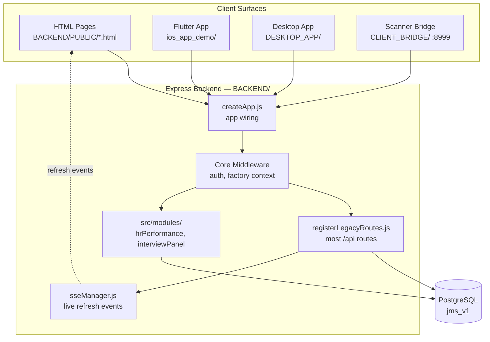
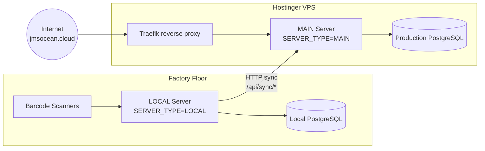
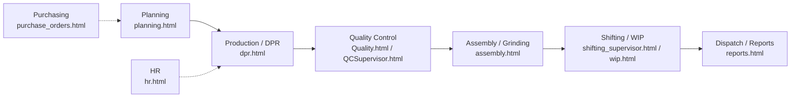
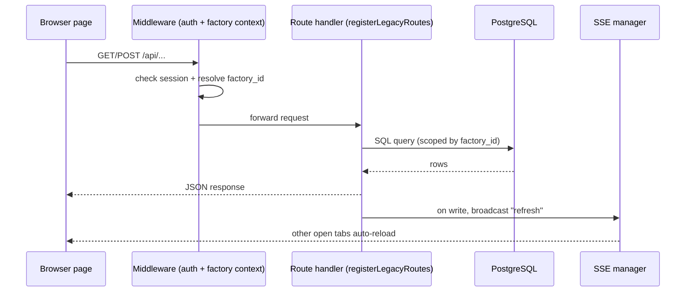
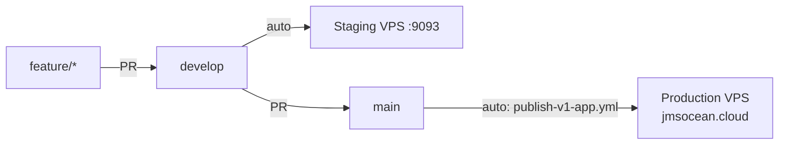

# Architecture — The Digital Map

> How every part of JMS Enterprise connects. Diagrams render automatically on GitHub.

---

## 1. System map (the whole picture)

---

## 2. LOCAL vs MAIN (the two-server model)

The app runs in two modes set by the `SERVER_TYPE` env var. This is the most important architectural idea in the project.

**Why two servers?** The factory must keep scanning and recording production even if the internet drops. LOCAL owns the shop floor; MAIN owns the internet-facing production DB. LOCAL pushes its data up to MAIN via `/api/sync/*` endpoints.

> ⚠️ On the VPS, the app compose file **must** keep its `traefik.*` labels or the whole site 404s — routing is handled by a shared-host Traefik.

---

## 3. A job's lifecycle (the core business flow)

This is what the software actually does, end to end:

| Stage | What happens | Main page |
|-------|-------------|-----------|
| **Planning** | Schedule which job runs on which machine/shift | `planning.html` |
| **Production (DPR)** | Record daily output per machine | `dpr.html` |
| **Quality** | Inspect & pass/reject batches | `Quality.html`, `QCSupervisor.html` |
| **Assembly / Grinding** | Post-moulding processing | `assembly.html`, `grinding.html` |
| **Shifting / WIP** | Move work-in-progress between locations | `shifting_supervisor.html`, `wip.html` |
| **Dispatch / Reports** | Final output & reporting | `reports.html` |

---

## 4. Request flow (what happens on one API call)

**Key detail:** almost every query is scoped by `factory_id` (multi-factory support), resolved from the request context in `src/app/requestContext.js`. After any successful write, `sseManager` broadcasts a lightweight refresh so other open tabs update live.

---

## 5. Deploy pipeline

- Push to **develop** → auto-deploys to **staging**.
- Merge **develop → main** → auto-builds the Docker image, pushes to GHCR, and deploys to the **production VPS** over SSH (with a safety DB dump + health check).
- Startup sequence is fixed and must never be reordered: **wait-postgres → auto-import → node server.js**.

See [../DEPLOYMENT.md](../DEPLOYMENT.md) and [../CLAUDE.md](../CLAUDE.md) for the full deploy reference.
